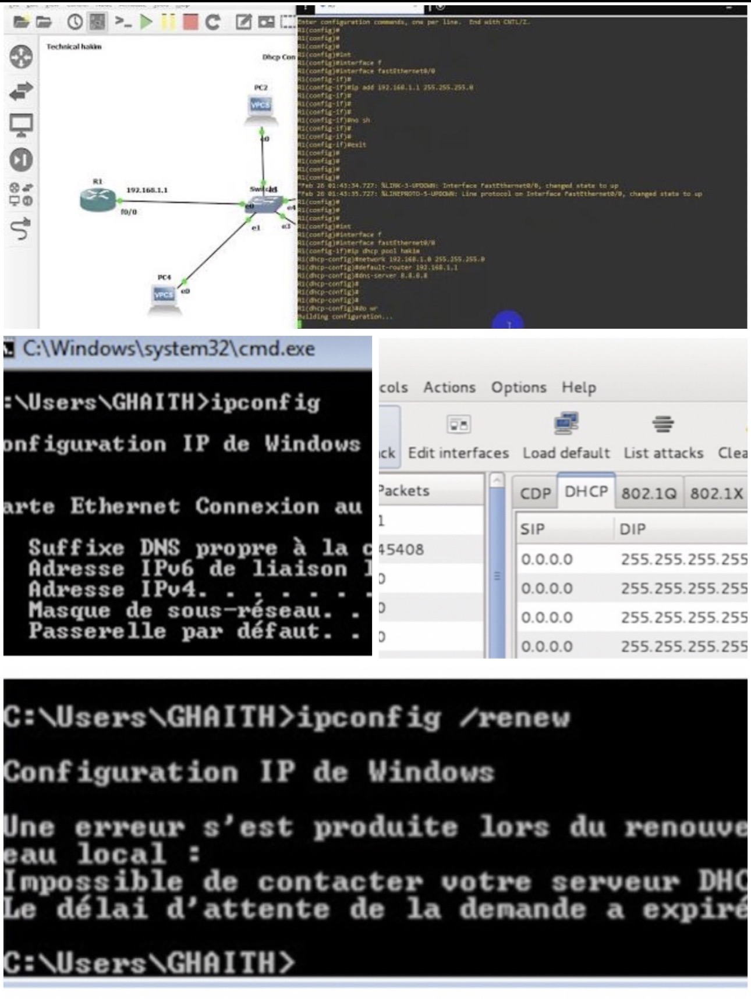

cat << 'EOF' > README.md
# DHCP Starvation Attack Simulation using GNS3

## 📌 Academic Project Overview
This project demonstrates the deployment of a DHCP infrastructure and the simulation of a DHCP Starvation attack within a GNS3 virtual network environment. The objective is to study DHCP behavior, exploit protocol weaknesses, and analyze network traffic during an attack scenario.

Institution: ISIKEF  
Location: El Kef, Tunisia  
Academic Year: 2022–2023  
Project Type: Academic / Network Security Lab

---

## 🎯 Project Objectives
- Design and simulate a network using GNS3
- Configure and deploy a functional DHCP server
- Perform a DHCP Starvation attack using Yersinia
- Analyze DHCP traffic using Wireshark
- Evaluate the impact of the attack on network availability
- Document vulnerabilities and mitigation techniques

---

## 🏗 Network Architecture
Components:
- Kali Linux (Attacker)
- Ubuntu Server (DHCP Server)
- Multiple DHCP Clients (VPCS)
- Virtual Ethernet Switch

Topology:
Attacker -> Switch -> DHCP Server + Clients

Network Range: 192.168.10.0/24  
DHCP Pool: 192.168.10.50 – 192.168.10.100

---

## 🛠 Tools & Technologies
- GNS3
- Kali Linux
- Ubuntu Server
- ISC DHCP Server
- Yersinia
- Wireshark

---

## ⚙️ DHCP Server Configuration
Installation:
sudo apt update  
sudo apt install isc-dhcp-server -y  

Configuration file: /etc/dhcp/dhcpd.conf

Subnet configuration includes:
- Dynamic IP range
- DNS configuration
- Lease time management

---

## ⚠️ DHCP Starvation Attack
A DHCP starvation attack floods the DHCP server with fake DHCP Discover requests using spoofed MAC addresses.

Tool used: Yersinia

Attack execution:
sudo yersinia -I

Attack impact:
- IP pool exhaustion
- Legitimate clients denied service
- Network denial of service

---

## 📡 Traffic Analysis
Wireshark filters used:
bootp  
dhcp  

Observed packets:
- DHCP Discover
- DHCP Offer
- DHCP Request
- DHCP ACK

---

## 🛡 Mitigation Techniques
- DHCP Snooping
- Port Security
- Rate Limiting
- Static DHCP Assignments
- Network Segmentation

---

## 📁 Project Structure
architecture/  
gns3/  
dhcp_server/  
attack_simulation/  
traffic_analysis/  
logs/  

---

## ⚠️ Disclaimer
This project is strictly for educational purposes. Unauthorized use is prohibited.

---

## 👨‍🎓 Author
Ghaith Riabi  
Cybersecurity / SOC Track  
Tunisia
EOF
